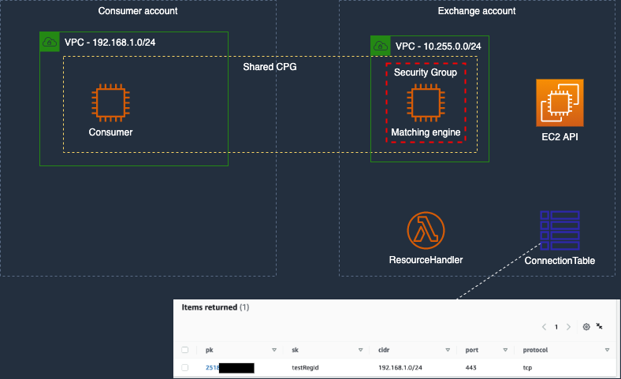
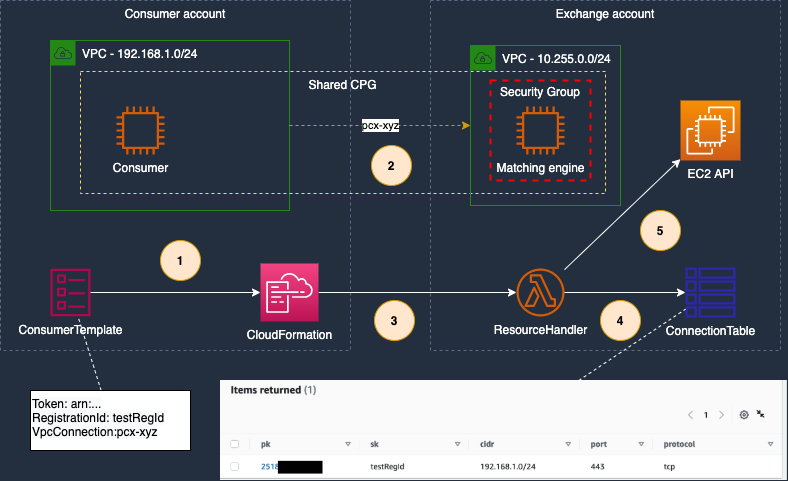
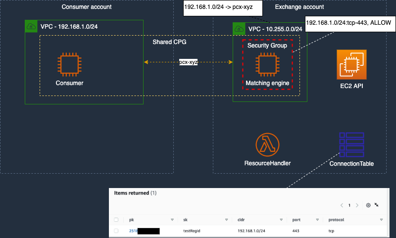

# Cross-account VPC peering automation

# Intro
This repo contains the cdk, custom lambda logic, and worked example to setup a cross-account VPC peering without requiring cross-account IAM trust. It does this by using a CloudFormation custom resource provider that executes the remote side of the peering connection including routing and security group configuration updates.

The cross-account provider setup is provided as a cdk construct and the key part of this repo. You are encouraged to re-use this construct as part of your own, more sophisticated, environments.  The stacks provided in this repo exist to provide a worked example deployment for experimentation and demonstration purposes.

# Sequence of events

## Initial setup
1. Initially the provider deploys the Amazon DynamoDB table and custom resource handler
2. The provider fills out the table with connectivity information for their consumer
3. provider shares wit the consumer
* The provider account ID
* The consumer registration code
* The arn of the custom resource provider



## Consumer invokes peering
1. consumer sets up a VPC peering with provider
2. consumer creates a CloudFormation custom resource targeting the pre-communicated custom resource handler arn and passing their registration ID
3. Custom resource invokes provider's Lambda handler
4. Custom resource handler looks-up provided information looking for a match for accountID and secret string
5. If there is a match custom resource handler invokes EC2 APIs to complete the end-to-end connectivity
 


## End state

Once step 5, above, has completed the environment state is as follows
* The VPC peering is accepted and established
* The security group for the provider has been updated to allow ingress from the consumer CIDR on the specified port and protocol
* The routing in the provider account route table is updated to enable return traffic flows to the consumer VPC via the VPC peering connection.




# Getting started with and deploying the example
The repo includes a fully worked example on how to deploy this. In a production use case you would likely use the cross-account cdk construct only instead of the whole example which includes setup of test VPCs

## Pre-reqs
1. Install nodejs v16+
2. [Install cdk v2](https://docs.aws.amazon.com/cdk/v2/guide/getting_started.html) 

## Deploy provider stack
As there are dependencies for the example we need to first deploy the provider stack

To run the example see the `cdk` folder and find the `./bin/environment.template.ts` file. Copy and rename the file to `environment.ts`

Within this file update the `PROVIDER_ACCOUNT` and `CONSUMER_ACCOUNT` (needed to allow cross-account lambda access) variable to match the account ID you wish to use for the provider. Ignore any other variables for now.

Bootstrap cdk in the provider account if not done already
`cdk bootstrap`

You can now deploy the provider test framework using 
`cdk deploy providerStack`

### Setup a peering entry for the consumer
The deployment of the stack created a DynamoDB table. In order for a consumer to make use of this you need to either manullay create an allow-list entry or use the cdk automation.

### Manually create an allow list entry

Create an entry in this table with the following values (see diagram above for reference)
* pk: the numeric account id of the consumer
* sk: a random (hard to guess) **secret** string that you will communicate to the consumer
* cidr: the allocated IP range for the consumer VPC to peer with - connection attempts with mismatching CIDR will be rejected
* port: a TCP/UDP port which will be granted access from the consumer account CIDR
* protocol: tcp | udp designating the protocol the consumer connection will use

### Automate allow list entries using a cdk Stack
The sample code includes the `ConsumerAllowListStack` which can maintain entries in your allow list table.

Update the `allowList` array to cover all consumer connections you want to allow then deploy the stack
`cdk deploy consumerAllowList`

## Deploy the consumer stack
Once you have deployed the provider stack, and updated the allow-list, you can use the outputs from the provider to setup the consumer variables in `environments.ts` based on the decisions and outputs from provider stack.

Bootstrap cdk in the consumer account if not done already
`cdk bootstrap`

Then deploy the example peering
`cdk deploy crossAccountPeering`

You should now see that a VPC peering has been setup and the provider account has updated routing and security to provide full end-to-end connectivity

To tear down you can simply run `cdk destroy crossAccountPeering`, and then you can re-run the previous step to recreate.

## Note: The use of CDK for consumers is optional (but recommended) - How to do it with Cfn or Terraform
As the solution is based on a custom CloudFormation resource this is the only mandatory part for consumers.
Consumers can use Cloudformation templates directly or embedded within terraform to invoke the cross-account automation

### CloudFormation and Terraform alternatives
The consumer needs to define the following custom resource. Note that the PeeringId will be known/provided by the consumer once they request the peering to the provider VPC.

**CloudFormation**
CloudFormation natievly supports CustomResources

```
Type: AWS::CloudFormation::CustomResource
Properties: 
  ServiceToken: ARN_OF_THE_PROVIDER_LAMBDA_FUNCTION
  RegistrationId: SHARED_SECRET_YOU_COMMUNICATED_TO_THE_CONSUMER
  PeeringId: ID_OF_THE_PEERING_REQUEST
```

**Terraform**
Terraform can be used to deploy CloudFormation stacks using embedded templates
```
resource "aws_cloudformation_stack" "cross-account_peering" {
  name = "cross-account-peering"
  parameters = {
    ServiceToken  = as_provided
    PeeringId = reference_to_peering_id
    RegistrationId = as_provided
  }

  template_body = <<STACK
{
  "AWSTemplateFormatVersion": "2010-09-09",
  "Parameters" : {
    "ServiceToken" : {
      "Type" : "String",
      "Description" : "Lambda Function ARN"
    },
    "PeeringId" : {
      "Type" : "String",
      "Description" : "ID of the VPC peering to be accepted"
    },
    "RegistrationId" : {
      "Type" : "String",
      "Description" : "Secret identification shared by the VPC peering provider"
    }
  },
  "Resources" : {
    "CrossAccountPeering": {
      "Type" : "AWS::CloudFormation::CustomResource",
      "DeletionPolicy" : "Delete",
      "UpdateReplacePolicy" : "Delete",
      "Properties" : {
        "ServiceToken" : { "Ref" : "ServiceToken" },
        "RegistrationId" : { "Ref" : "RegistrationId" },
        "PeeringId" : { "Ref" : "PeeringId" }
      }
    }
  }
}
STACK
}
```

## Security

See [CONTRIBUTING](CONTRIBUTING.md#security-issue-notifications) for more information.

## License

This library is licensed under the MIT-0 License. See the LICENSE file.
